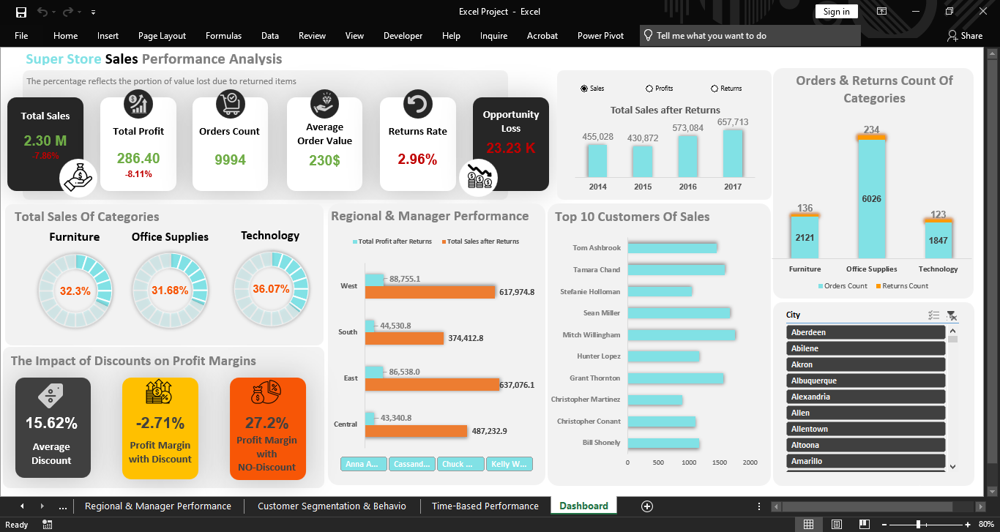

# End-to-End Excel Superstore Analysis 📊  

## 📌 Project Overview  
This project is an **end-to-end data analysis** of the famous *Superstore dataset* using **Microsoft Excel**.  
The goal is to clean raw data, model it, and build an interactive dashboard that provides actionable insights into **sales, profit, and returns**.  

---

## 🛠 Tools & Technologies  
- **Excel** (Power Query, Power Pivot, Pivot Tables, Pivot Charts, Dashboarding)  
- **DAX & Calculated Fields**  
- **Data Modeling**  

---

## 🔑 Key Steps  
1. **Data Cleaning & Transformation**  
   - Removed duplicates, handled missing values, and standardized fields using **Power Query**.  
2. **Data Modeling**  
   - Created relationships between tables (Orders, Returns, People).  
3. **Calculated Measures**  
   - Built KPIs such as *Total Sales, Profit After Returns, Return Rate, Opportunity Loss*.  
4. **Analysis**  
   - Financial & operational performance  
   - Product performance  
   - Regional insights  
   - Customer behavior  
   - Time-based performance  
5. **Dashboard**  
   - Designed a dynamic Excel dashboard with interactive filters and charts.  

---

## 📷 Dashboard Preview   
```markdown

